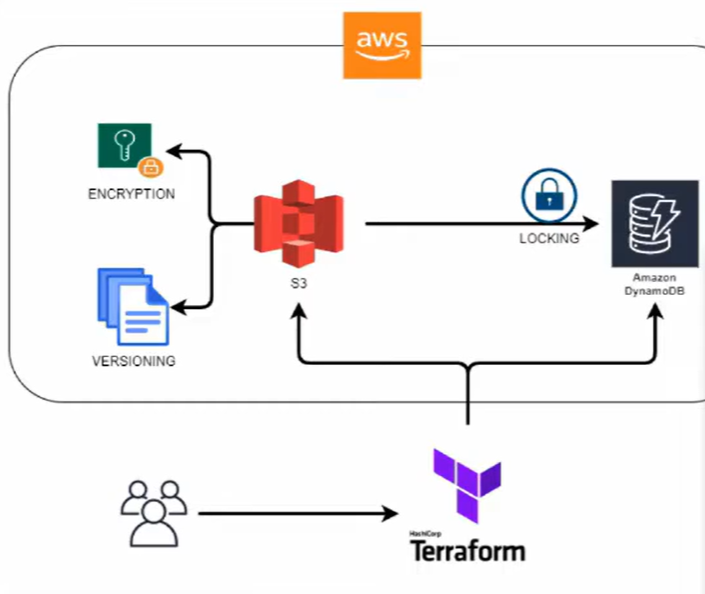
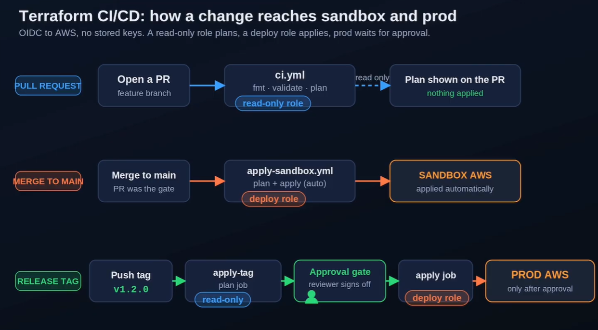

# Terraform modules

##W Remote aws backend state

We want to implement an architecture like this:



Store the tfstate file into s3 bucket. Storing our terraform file on bucket like s3 has several benefits:

- work in teams on the same terraform script.
- State Locking (prevents corruption of state)
- Versioning
- Encryption

State lock is essential because there is chance where several people working on the same code and they will make the push on the state file simoulteneasly. So we make all of this to avoid concurrency writing. Synamodb is used to avoid corruption of the state file

In this case we create an aws bucket inside terraform, dynamodb as well for lock and we use them. This is just a demonstration on how to create a backend for terraform projects using a terraform project itself.

In the terraform that use this backend you will configure the backend inside terraform like the following

```hcl
terraform {
      backend "s3" {
        bucket = "terraform-state"
        dynamodb_table = "terraform-locks"
        key = "global/mystatefile/terraform.tfstate" # I want to store my tfstate file inside this path
        region = "eu-central-1"
        encrypt = true

    }
}
```

This combination s3 + dynamodb won't be valid anymore after terraform version 1.10


## Remote minio backend state

This is similar to the one before, except for the fact that we use a docker compose to create minio bucket and then configuring the terraform project to use minio as a backend. In this case you can do

    terraform plan
    terraform apply

Inside the folder and no tfstate file will be saved inside that, but it will be saved inside minio


## Terraform CI-CD



In this case we play with terraform and Github CICD. We will use the aws s3 dynamodb combination for the backend


## Environemt Specific Variables

How terraform build your project:

 1. Identity is built
 2. Resources
 3. Inputs
 4. Dependencies
 5. Environment modifies identity

Enviroment modified identity.
At the beginning a  variable is a named slot, is a promise of future input. Same slot, different values, the environment decides the value.

*Environment is External* 

 - Environment logic is outside the graph
 - Graph structure must remain stable


## What to do in terraform projects before commit

1. terraform init
2. terraform validate
3. terraform-docs -c .terraform-docs.yml .
4. terraform fmt
5. tflint --recursive -f compact
6. terraform plan


<!-- BEGIN_TF_DOCS -->
## Requirements

No requirements.

## Providers

No providers.

## Modules

| Name | Source | Version |
|------|--------|---------|
| remote\_aws\_backend\_state | ./remote-aws-backend-state | n/a |
| remote\_minio\_backend\_state | ./remote_minio_backend_state | n/a |

## Resources

No resources.

## Inputs

No inputs.

## Outputs

No outputs.
<!-- END_TF_DOCS -->